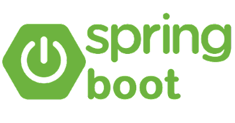

# Hi there 👋
    
### I am:
- Kan Oleg.
- 29 years old.
- Graduated from Odessa National Polytechnic University.
    > Learned:
    
    
    
- Overseas Korean Java Developer.
    > Currently, I live in South Korea.

    
<b>✨More details</b>
 
    I am from the southern part of Ukraine, but I was born in Uzbekistan. I lived in Ukraine half of my life, so I could say it is my homeland. Ukraine is a beautiful place with friendly people. Here I grew, studied and graduated from one of the biggest universities in my city.

During my study at the university, I had a brief experience coding in C++ and MATLAB. Also, I understood that to be an electrical engineer is not my way. Because I liked programming lessons, I decided to become a developer.

However, I knew I needed money for my studies, but working in my country was not the best choice. Luckily, I'm Korean and I have the opportunity to work in Korea. I had a plan and I stuck to the plan.
I worked in different factories with different people for three years.
Honestly, it was really hard, but I withstood, and now I can say, Korea is the best place I have been.

Then, I found out about the Habsida course and decided to live in Korea.

After getting into the Habsida program, I had the opportunity to learn about back-end programming and gain proficiency in Java and Spring framework. We solved various problems which required Spring Security, Spring MVC, Spring Boot, Maven, Hibernate, Tomcat, HTML, CSS, MySQL, JavaScript, Bootstrap, Thymeleaf, Rest API, GraphQL.

# My techical stack is:
- Back end:
  
  
  
- Front end:
  
  
- Database:
  
  
- Other:
  
  

<!--
# My certificates:
- [English](certificate/english.pdf)
- [Korean](certificate/korean.pdf)
- HABSIDA CODING SCHOOL

- Udemy
  - [Spring](certificate/zaur.pdf)
  - [Git](certificate/alishev.pdf)
  -->
  <!--
  # Other
  
  
  

**OlegKahn/OlegKahn** is a ✨ _special_ ✨ repository because its `README.md` (this file) appears on your GitHub profile.

Here are some ideas to get you started:

- 🔭 I’m currently working on ...
- 🌱 I’m currently learning ...
- 👯 I’m looking to collaborate on ...
- 🤔 I’m looking for help with ...
- 💬 Ask me about ...
- 📫 How to reach me: ...
- 😄 Pronouns: ...
- ⚡ Fun fact: ...
-->
